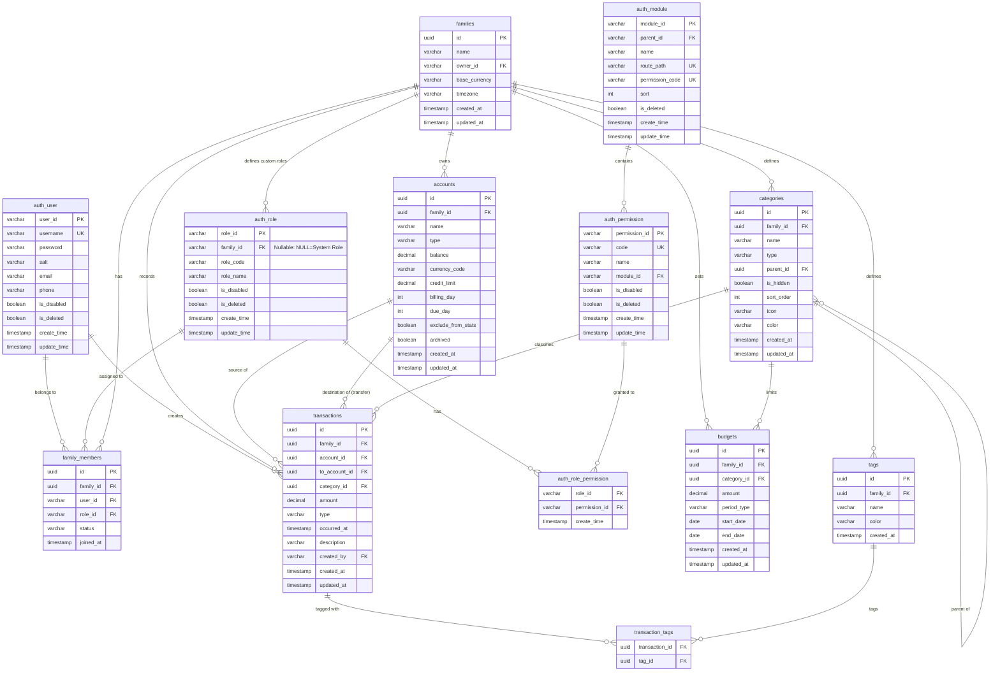

# 家庭财务管理系统数据库设计 (Database Schema)

## 1. 概述

本文档描述了家庭财务管理系统（Family Finance）的数据库设计。基于 PostgreSQL 关系型数据库，采用 Snake Case (`snake_case`) 命名规范。

设计目标：

- **融合系统级权限**：直接使用 `packages/infra/src/postgresql/schema/auth` 中的用户和权限表结构。
- **支持多租户**：以 `families` (账本) 为核心隔离单元，通过 `family_members` 关联用户和角色。
- **支持自定义角色**：`auth_role` 支持系统预设角色（全局）和家庭自定义角色（租户级）。
- **支持复杂的财务交易**：收入、支出、转账等。

## 2. ER 图 (Entity-Relationship Diagram)

## 3. 表结构详解

### 3.1 认证与权限 (Authentication & Authorization)

> **注意**：这部分直接复用 `packages/infra/src/postgresql/schema/auth` 中的现有定义。
> 所有表名以 `auth_` 开头。

#### 1. 用户表 (`auth_user`)

系统全局用户表。
**支持虚拟账户**：用于家庭中无法独立操作成员（如儿童、老人），由其他成员代为管理。

**虚拟账户策略**：

1.  **密码约束**：数据库 `password` 字段保持 **NOT NULL**。
2.  **创建逻辑**：创建虚拟账户时，后端自动生成一个**高强度随机密码**（或特定占位符）存入。
3.  **登录拦截**：在登录接口（`AuthService.login`）中增加校验，如果检测到用户 `is_virtual = true`，则**直接拒绝登录**（抛出“虚拟账户不可登录”异常）。
4.  **激活机制**：未来提供“激活”功能，允许监护人设置真实的手机号/邮箱和新密码，将 `is_virtual` 更新为 `false`，使其转为正式账户。

| 字段名        | 类型         | 约束             | 说明                                              |
| :------------ | :----------- | :--------------- | :------------------------------------------------ |
| `user_id`     | VARCHAR(32)  | PK               | 用户唯一标识 (Snowflake/UUID)                     |
| `username`    | VARCHAR(30)  | UNIQUE, NOT NULL | 用户名 (虚拟用户可由系统自动生成，如 `v_sf82...`) |
| `nickname`    | VARCHAR(50)  | **NOT NULL**     | 用户昵称 (默认值: `用户_{随机后缀}` 或 `用户`)    |
| `password`    | VARCHAR(100) | **NOT NULL**     | 加密后的密码 (**虚拟用户存随机垃圾值**)           |
| `salt`        | VARCHAR(16)  | **NOT NULL**     | 密码盐                                            |
| `email`       | VARCHAR(50)  | NULLABLE         | 邮箱 (**虚拟用户可为空**)                         |
| `phone`       | VARCHAR(11)  | NULLABLE         | 手机号 (**虚拟用户可为空**)                       |
| `is_virtual`  | BOOLEAN      | DEFAULT FALSE    | **新增**：是否为虚拟账户                          |
| `is_disabled` | BOOLEAN      | DEFAULT FALSE    | 账号是否禁用                                      |
| `is_deleted`  | BOOLEAN      | DEFAULT FALSE    | 软删除标记                                        |
| `create_time` | TIMESTAMP    | DEFAULT NOW()    | 创建时间                                          |
| `update_time` | TIMESTAMP    | DEFAULT NOW()    | 更新时间                                          |

#### 2. 角色表 (`auth_role`)

定义系统内的角色。
**完全隔离策略**：为了确保每个家庭都能独立修改角色权限，**在创建家庭时，系统会自动复制 4 个默认角色（Owner, Admin, Member, Guest）并绑定到该家庭 ID**。

**业务逻辑约束**：

1.  **模版角色**：`family_id` 为 NULL 的记录仅作为**初始化模版**存在，**不直接分配给用户**。
2.  **家庭角色**：用户实际拥有的角色，其 `family_id` **必须** 指向具体的家庭。
3.  **独立修改**：因为每个家庭都有自己独立的 4 个角色副本，用户可以随意修改（如改名、增减权限），互不影响。

| 字段名        | 类型        | 约束              | 说明                                                 |
| :------------ | :---------- | :---------------- | :--------------------------------------------------- |
| `role_id`     | VARCHAR(32) | PK                | 角色ID                                               |
| `family_id`   | UUID        | FK -> families.id | **所属家庭ID**。NULL=模版；非空=实际使用的家庭角色。 |
| `role_code`   | VARCHAR(30) | NOT NULL          | 角色编码 (e.g. `FAMILY_OWNER`)                       |
| `role_name`   | VARCHAR(50) | NOT NULL          | 角色名称 (e.g. "家庭拥有者")                         |
| `is_disabled` | BOOLEAN     | DEFAULT FALSE     |                                                      |
| `is_deleted`  | BOOLEAN     | DEFAULT FALSE     |                                                      |
| `create_time` | TIMESTAMP   | DEFAULT NOW()     |                                                      |
| `update_time` | TIMESTAMP   | DEFAULT NOW()     |                                                      |

**约束逻辑**：

- `UNIQUE(role_code, family_id)`：确保同一家庭内角色编码唯一。

#### 3. 权限表 (`auth_permission`)

定义细粒度的操作权限（如：创建账本、查看流水）。
权限点通常由系统开发者定义，用户不可新增，只能组合。

| 字段名          | 类型        | 约束              | 说明                          |
| :-------------- | :---------- | :---------------- | :---------------------------- |
| `permission_id` | VARCHAR(32) | PK                | 权限ID                        |
| `code`          | VARCHAR(80) | UNIQUE, NOT NULL  | 权限标识 (e.g. `book:create`) |
| `name`          | VARCHAR(80) | NOT NULL          | 权限名称                      |
| `module_id`     | VARCHAR(32) | FK -> auth_module | 所属模块                      |
| `is_disabled`   | BOOLEAN     | DEFAULT FALSE     |                               |
| `is_deleted`    | BOOLEAN     | DEFAULT FALSE     |                               |
| `create_time`   | TIMESTAMP   | DEFAULT NOW()     |                               |
| `update_time`   | TIMESTAMP   | DEFAULT NOW()     |                               |

#### 4. 角色-权限关联表 (`auth_role_permission`)

定义角色拥有的权限集合。用户自定义角色时，就是向此表插入该自定义角色ID对应的权限列表。

| 字段名          | 类型                     | 约束                  | 说明     |
| :-------------- | :----------------------- | :-------------------- | :------- |
| `role_id`       | VARCHAR(32)              | FK -> auth_role       |          |
| `permission_id` | VARCHAR(32)              | FK -> auth_permission |          |
| `create_time`   | TIMESTAMP                | DEFAULT NOW()         |          |
| **PK**          | (role_id, permission_id) |                       | 联合主键 |

#### 5. 模块表 (`auth_module`)

定义系统模块结构，用于前端菜单生成和权限分组。

| 字段名            | 类型         | 约束              | 说明           |
| :---------------- | :----------- | :---------------- | :------------- |
| `module_id`       | VARCHAR(32)  | PK                | 模块ID         |
| `parent_id`       | VARCHAR(32)  | FK -> auth_module | 父模块ID       |
| `name`            | VARCHAR(80)  | NOT NULL          | 模块名称       |
| `route_path`      | VARCHAR(200) | UNIQUE, NOT NULL  | 前端路由路径   |
| `permission_code` | VARCHAR(80)  | UNIQUE, NOT NULL  | 关联的权限标识 |
| `sort`            | INTEGER      | DEFAULT 0         | 排序           |
| `is_deleted`      | BOOLEAN      | DEFAULT FALSE     |                |
| `create_time`     | TIMESTAMP    | DEFAULT NOW()     |                |
| `update_time`     | TIMESTAMP    | DEFAULT NOW()     |                |

---

### 3.2 业务核心：家庭与成员 (Families & Members)

#### 6. 家庭/账本表 (`families`)

租户隔离的核心单元。W1 阶段对应 "Book" (账本)。

| 字段名          | 类型        | 约束                    | 说明                          |
| :-------------- | :---------- | :---------------------- | :---------------------------- |
| `id`            | UUID        | PK                      | 家庭/账本ID                   |
| `name`          | VARCHAR     | NOT NULL                | 家庭名称 (e.g. "我的账本")    |
| `owner_id`      | VARCHAR(32) | FK -> auth_user.user_id | 创建者/所有者                 |
| `base_currency` | VARCHAR     | DEFAULT 'CNY'           | 家庭本位币 (报表统计以此为准) |
| `timezone`      | VARCHAR     | DEFAULT 'Asia/Shanghai' | 时区 (影响按月/按日统计边界)  |
| `created_at`    | TIMESTAMP   | DEFAULT NOW()           | 创建时间                      |
| `updated_at`    | TIMESTAMP   | DEFAULT NOW()           | 更新时间                      |

#### 7. 家庭成员表 (`family_members`)

连接用户、家庭和角色，实现基于家庭的 RBAC。

| 字段名      | 类型        | 约束                                  | 说明                                              |
| :---------- | :---------- | :------------------------------------ | :------------------------------------------------ |
| `id`        | UUID        | PK                                    |                                                   |
| `family_id` | UUID        | FK -> families.id                     |                                                   |
| `user_id`   | VARCHAR(32) | FK -> auth_user.user_id               |                                                   |
| `role_id`   | VARCHAR(32) | FK -> auth_role.role_id               | 用户在该家庭中的角色 (System Role OR Custom Role) |
| `status`    | VARCHAR     | ENUM('INVITED', 'ACTIVE', 'DISABLED') | 状态                                              |
| `joined_at` | TIMESTAMP   | DEFAULT NOW()                         | 加入时间                                          |

---

### 3.3 财务核心 (Finance Core)

#### 8. 账户表 (`accounts`)

管理资金的容器。

| 字段名               | 类型      | 约束              | 说明                                 |
| :------------------- | :-------- | :---------------- | :----------------------------------- |
| `id`                 | UUID      | PK                |                                      |
| `family_id`          | UUID      | FK -> families.id | 所属家庭                             |
| `name`               | VARCHAR   | NOT NULL          | 账户名称 (e.g. "招商银行卡")         |
| `type`               | VARCHAR   | NOT NULL          | CASH, BANK, CREDIT, INVESTMENT, LOAN |
| `balance`            | DECIMAL   | DEFAULT 0         | 当前余额                             |
| `currency_code`      | VARCHAR   | DEFAULT 'CNY'     | 账户币种                             |
| `credit_limit`       | DECIMAL   |                   | 信用额度 (信用卡专用)                |
| `billing_day`        | INT       |                   | 账单日 (1-31)                        |
| `due_day`            | INT       |                   | 还款日 (1-31)                        |
| `exclude_from_stats` | BOOLEAN   | DEFAULT FALSE     | 是否不计入总资产统计                 |
| `archived`           | BOOLEAN   | DEFAULT FALSE     | 是否归档 (软删除)                    |
| `sort_order`         | INT       | DEFAULT 0         | 排序权重                             |
| `created_at`         | TIMESTAMP | DEFAULT NOW()     |                                      |
| `updated_at`         | TIMESTAMP | DEFAULT NOW()     |                                      |

#### 9. 分类表 (`categories`)

收支分类，支持多级树形结构。

| 字段名       | 类型      | 约束                      | 说明                    |
| :----------- | :-------- | :------------------------ | :---------------------- |
| `id`         | UUID      | PK                        |                         |
| `family_id`  | UUID      | FK -> families.id         |                         |
| `name`       | VARCHAR   | NOT NULL                  | 分类名称 (e.g. "餐饮")  |
| `type`       | VARCHAR   | ENUM('EXPENSE', 'INCOME') | 类型 (支出/收入)        |
| `parent_id`  | UUID      | FK -> categories.id       | 父分类ID (空为一级分类) |
| `is_hidden`  | BOOLEAN   | DEFAULT FALSE             | 是否隐藏                |
| `sort_order` | INT       | DEFAULT 0                 | 排序                    |
| `icon`       | VARCHAR   |                           | 图标                    |
| `color`      | VARCHAR   |                           | 颜色                    |
| `created_at` | TIMESTAMP | DEFAULT NOW()             |                         |
| `updated_at` | TIMESTAMP | DEFAULT NOW()             |                         |

#### 10. 标签表 (`tags`)

交易的多维度标记（如：#旅游 #装修）。

| 字段名       | 类型      | 约束              | 说明     |
| :----------- | :-------- | :---------------- | :------- |
| `id`         | UUID      | PK                |          |
| `family_id`  | UUID      | FK -> families.id |          |
| `name`       | VARCHAR   | NOT NULL          | 标签名称 |
| `color`      | VARCHAR   |                   | 标签颜色 |
| `created_at` | TIMESTAMP | DEFAULT NOW()     |          |

---

### 3.4 交易流水 (Transactions)

#### 11. 交易流水表 (`transactions`)

系统的核心数据表，记录每一笔资金变动。

**虚拟账户代记账逻辑**：

- 当用户（如父母）为虚拟账户（如孩子）代记账时，**`created_by` 字段应存储该虚拟账户的 ID**。
- 这样在统计报表中，该笔交易将直接归属于孩子。
- 建议在系统日志（Audit Log）中额外记录实际操作人（Operator ID），以便追溯。

| 字段名          | 类型        | 约束                                  | 说明                                  |
| :-------------- | :---------- | :------------------------------------ | :------------------------------------ |
| `id`            | UUID        | PK                                    |                                       |
| `family_id`     | UUID        | FK -> families.id                     | 方便按家庭分库分表或查询              |
| `account_id`    | UUID        | FK -> accounts.id                     | 关联账户 (支出账户/收入账户/转出账户) |
| `to_account_id` | UUID        | FK -> accounts.id                     | 转入账户 (仅 TRANSFER 类型有效)       |
| `category_id`   | UUID        | FK -> categories.id                   | 关联分类 (TRANSFER 类型通常为空)      |
| `amount`        | DECIMAL     | NOT NULL, CHECK(amount>=0)            | 金额 (始终为正数)                     |
| `type`          | VARCHAR     | ENUM('EXPENSE', 'INCOME', 'TRANSFER') | 交易类型                              |
| `occurred_at`   | TIMESTAMP   | NOT NULL                              | 交易发生时间                          |
| `description`   | TEXT        |                                       | 备注/描述                             |
| `created_by`    | VARCHAR(32) | FK -> auth_user.user_id               | 记录人 (可是**虚拟用户ID**)           |
| `created_at`    | TIMESTAMP   | DEFAULT NOW()                         | 入库时间                              |
| `updated_at`    | TIMESTAMP   | DEFAULT NOW()                         |                                       |

#### 12. 交易-标签关联表 (`transaction_tags`)

多对多关系表。

| 字段名           | 类型                     | 约束                  | 说明     |
| :--------------- | :----------------------- | :-------------------- | :------- |
| `transaction_id` | UUID                     | FK -> transactions.id |          |
| `tag_id`         | UUID                     | FK -> tags.id         |          |
| **PK**           | (transaction_id, tag_id) |                       | 联合主键 |

---

### 3.5 预算 (Budgeting)

#### 13. 预算表 (`budgets`)

设置消费限额。

| 字段名        | 类型      | 约束                                 | 说明                                |
| :------------ | :-------- | :----------------------------------- | :---------------------------------- |
| `id`          | UUID      | PK                                   |                                     |
| `family_id`   | UUID      | FK -> families.id                    |                                     |
| `category_id` | UUID      | FK -> categories.id                  | 预算关联的分类 (为空则为家庭总预算) |
| `amount`      | DECIMAL   | NOT NULL                             | 预算金额                            |
| `period_type` | VARCHAR   | ENUM('MONTHLY', 'YEARLY', 'ONE_OFF') | 周期类型                            |
| `start_date`  | DATE      | NOT NULL                             | 开始日期                            |
| `end_date`    | DATE      |                                      | 结束日期                            |
| `created_at`  | TIMESTAMP | DEFAULT NOW()                        |                                     |
| `updated_at`  | TIMESTAMP | DEFAULT NOW()                        |                                     |

---

### 3.6 系统审计 (System Audit)

#### 14. 审计日志表 (`sys_audit_log`)

记录关键业务操作日志（Who did What to Whom and When）。
这对于**虚拟账户**场景尤为重要，因为我们需要知道“这笔归属于孩子的账，到底是谁记的”。

| 字段名          | 类型        | 约束                    | 说明                                |
| :-------------- | :---------- | :---------------------- | :---------------------------------- |
| `id`            | UUID        | PK                      |                                     |
| `user_id`       | VARCHAR(32) | FK -> auth_user.user_id | **实际操作人** (Operator ID)        |
| `family_id`     | UUID        | FK -> families.id       | 所属家庭 (可为空，如系统级操作)     |
| `action`        | VARCHAR(50) | NOT NULL                | 操作类型 (e.g., `CREATE`, `UPDATE`) |
| `target_entity` | VARCHAR(50) | NOT NULL                | 操作对象 (e.g., `TRANSACTION`)      |
| `target_id`     | VARCHAR(50) | NOT NULL                | 对象ID (e.g., 流水ID)               |
| `changes`       | JSONB       |                         | 变更内容快照 (Old/New Values)       |
| `ip_address`    | VARCHAR(45) |                         | 操作IP                              |
| `user_agent`    | VARCHAR     |                         | 客户端信息                          |
| `created_at`    | TIMESTAMP   | DEFAULT NOW()           | 操作时间                            |

> **存储策略说明**：
> 对于中小规模的家庭理财应用，建议直接**存储在数据库**中。
>
> 1.  **数据关联强**：审计日志常需要关联 User/Family 信息展示给用户（如“修改历史”）。
> 2.  **事务一致性**：业务操作成功才记录日志，数据库事务能保证这一点。
> 3.  **成本低**：无需维护额外的日志服务（如 ELK）。定期清理（如保留 6 个月）即可防止表过大。
